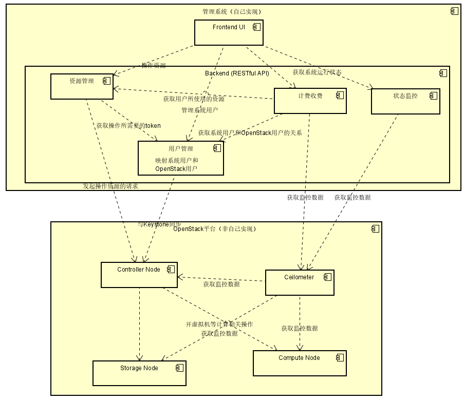

# 重要谈话记录

这份文档将会记录所有在项目进行中比较重要的聊天内容，以**日期，说话人，标签，内容**来组织。

**2020年1月29日 21:10，导师** *原始需求*

> 设计一个三级管理体系，假设做一个云，可以吧这个买给学校。学校再把资源卖给老师，老师再限定学生可以使用一定量的资源。学生不交费，但是老师要交钱给学校，学校要交钱给我们。

**2020年2月03日 20:49，我** *需求精化* *架构设计*

> 
> - “云可以卖给学校”指的是学校可以购买到云平台整个软件并部署在自己的硬件等基础设施上，部署和维护等都由学校自己负责，类似卖序列号和安装包的模式（比如JetBrains IDE），或者说On-Premises模式？如果是这样，那这个的管理系统是否是和这个云平台的管理系统是独立的，它的作用仅是管理卖出的授权并按收费方式（比如永久或者按年付费）计费即可？
> - “学校可以卖分配资源给老师，老师需要给学校付费”这个是否类似于现在各种云平台（比如阿里云等）按带宽、CPU、内存、硬盘分配资源，并按使用量付费的模式？
> - “老师限定学生可以使用一定的资源”这个部分是否和学校和老师之间的分配模式相似（即按带宽、CPU、内存、硬盘分配资源），唯一区别只是不进行付费而已？
> - 对于这个云平台的管理系统，我目前认为一个比较简单的实现方式是：
>    - 对OpenStack再包一层，主要实现业务逻辑。这个管理系统，对用户（学校、老师和学生）提供UI，根据用户的请求，发起对后端的OpenStack平台的API的请求
>    - 用户管理、计费、记账、收费等业务逻辑在这层管理系统中实现（因为它记录各个用户被分配的资源量的使用时间，不需要将其下放到OpenStack中）
>    - 整个系统被当作一个完整的整体卖给学校进行On-Premises部署
>    - OpenStack部分可以对用户的使用环境进行一些限制或者预设（比如只能使用某个发行版，必须有几台机器，必须使用Keystone来鉴权等）和/或使用Ansible等配置管理工具来简化OpenStack自动化部署的过程
> - 老师认为这个实现方式是可行的吗？由于毕设的目标是想完全实现整个系统（包括前端、业务逻辑和OpenStack部署）。对我个人来说，前端和业务逻辑部分应该难度不大，主要是OpenStack部分不够熟悉，所以老师能否评估一下和OpenStack相关部分的难度（主要是限制可使用资源）？

**2020年2月04日 00:26，导师** *需求精化* *架构设计*

> 1. 云平台暂时不考虑在各个高校部署，只是我们自己部署运营。所谓卖给学校是指学校在我们云平台上建一个大账号。
> 2. 学校可以卖分配资源给老师，老师需要给学校付费 您的理解没有问题
> 3. “老师限定学生可以使用一定的资源” 您的理解没有问题
> 4. 难度不太好说，主要看您对python语言与库，操作系统，网络的熟悉程度，如果都比较熟悉是不算太难的，如果有一样不熟悉，被卡住了肯能会挺花时间的。但是总的来说编写一个能够运行的系统不算太难，能长期稳定运行，出现各种问题可以迅速解决，在生命周期中能不断升级还是挺难的。

**2020年2月04日 20:56，我** *需求精化* *架构设计*

> 谢谢老师。现在我还有几个问题：
> -	按照这个需求，照我的理解，项目可以分成两个部分：计费收费服务（类似cloudkitty），以及用来替代Horizon的更贴近业务的管理系统。
> -	管理系统其实是一个普通的CRUD Web应用，提供状态管理、用户管理、虚拟机创建和管理等常规操作，系统中的用户不操作OpenStack，而是直接操作我们自己的管理系统，管理系统为用户向OpenStack请求资源。这套管理系统不需要部署在openstack的网络上。
> -	对于状态监控，一些细节：
>   - 状态监控按理说可以用ceilometer和gnocchi做，我也已经成功部署ceilometer和gnocchi，也已经看到有instance的操作记录，准备明天继续看看使用方法
>   - 我刚发现Horizon上有Usage Summary部分，里面的包括CPU小时数、硬盘小时数和内存小时数等，不清楚是装了ceilometer后才有的还是一直都有的，等会去云上开个虚拟机装下devstack看看。但不管怎么说，这些信息已经可以用来实现状态监控系统了。
> -	资源限制实现细节:
>   - 资源限制直接在业务逻辑做，不用openstack的quota，也不用ceilometer的监控
>   - 只限制CPU、内存、硬盘的分配量，不涉及网络
>   - 用户在界面上操作，分配完成即开始计费，不计算是否使用
>   - 学校（平台）给平台（老师）开启账号，就开始计算平台（老师）的费用；每个计费周期（比如一个月）结束时，或者平台（老师）修改自己所需要的资源时，就计算一次上个计费周期的价格，并发出invoice
> - 这样分配和计费就完全不涉及OpenStack，业务逻辑本身可以自己实现，降低难度
> -	决定还是采用python和flask来写这套后台管理系统
> -	毕设选题我认为可以叫“基于OpenStack的教学云管理系统的设计和实现”，简介如下：
>   -	本项目将基于OpenStack实现一个教学云平台的管理系统。学校可以在云平台注册一些资源，学校可以将其中的一些资源分配给老师，老师将其资源有限地分配给学生。平台对学校、以及学校对老师根据所分配的CPU、内存和硬盘资源进行计费，老师对学生不进行计费。管理系统还对各个用户提供状态监控、用户管理、资源管理、计费收费功能。
>
> 以下是我目前考虑的架构图：
> 

**2020年02月07日 16:06，我** *需求精化*

发了一下[0207-requirement-list](requirements/0207-requirement-list.md)的内容。

**2020年02月08日 08:19，导师** *需求精化*

1. 项目对用户计费而不收费。
2. Project可以对User设定quota，User超过quota，需要Project Admin手动解开。
3. Project Admin 和 Domain Admin都可以指定助理完成管理工作。
4. 所有用户，包括Projecrt Admin， Domain Admin都要实名。到Domain级别的单位隶属关系要争取。
5. 所有domain，Project，User都需要收取管理费，Domain的管理费100元/月，Project管理费10元/月，User管理费1元/月。连续18个月不交管理费就清除相应的Domain，Project，User

费用小于一个额度，需要邮件提醒。
费用为为0锁定（domain，Project）用户使用完 Project 分配的quota也要锁定。（锁定：用户服务不可访问），相应的Admin需要登录系统手动解封，并设置信用额度。信用额度上限由上级管理设定。

另外还需要提供一些查询报表功能
各级管理员可以查询交费明细，
可以查询计费明细。

**2020年02年08月 09:37，我** *需求精化*

0. 按目前我的考虑，计费收费的根据是**分配的资源**，而非使用的资源
   1. 对domain和project来说，即是一旦他们被分配可用资源后，即开始按照已经分配的部分进行收费，而不是看具体使用了多少资源
      1. 比如云平台给Domain限制了40个CPU 80G内存，那么domain可以给其下的project分配资源，但是给project分配的总量不能超过这么多；不管分配了多少，收费还是按照40CPU 80G内存进行收费。
   2. 对user同理，project给user限制可以使用资源，那么user在创建资源的时候，如果想创建的资源已经超过了它还可以使用的资源，那么user直接是不能创建资源了
      1. 比如用户限额是3个CPU 8G内存，用户已经用了2个CPU 4G内存，当用户想要再创建一个2CPU 4G内存的虚拟机时就会创建失败
   3. 这样实现的话，整个计费收费功能都不用和openstack打交道
   4. 这就导致了：
1. 项目对用户计费似乎是没有意义的，因为用户又不交钱，给用户设立计费标准并通过给用户设定的限制计费出来的数据有什么用吗？
2. 用户永远不会超过quota，因为当他在创建资源的时候一旦超过quota，创建资源就会失败（所以用户这里用的词是资源限制）
3. system admin，domain admin和project admin都可以指定某个自己domain（系统domain是Default）或者project下的用户为自己的其他domain/project的admin。这里可以改一下限制，即domain admin也可以属于某一个project。我之前考虑的domain admin不能属于project感觉不太必要。但是由系统管理员创建的domain admin用户仍然不能加入其他project。
4. 实名可以采用由对应admin统一管理的方法，不允许自由注册；什么叫单位隶属关系？
5. 按以上逻辑，domain和project管理费没有任何问题，如果对user收管理费的话，是不是user唯一需要支付的钱就是1元每月的管理费？（user不支付资源费用，它只是使用由project分配给它的资源）

另外对于交费我想的是一种以充值为中心的交费方法：

1. 即所有用户要使用平台，首先需要往自己的账号里充值
2. 扣款的时候，按分配的资源每小时扣除账号里的钱
3. 管理费每月从账号里直接打到系统管理员的账号
4. 对系统、domain和project，其可以用多个admin，但是收费是从某一个指定的admin的账户里扣费。
5. project扣费是从负责收费的project admin的账号打到其负责收费的domain admin的账号里；domain扣费是从负责收费的domain admin账号打到负责收费的系统管理员的账号里。扣费用户可以由现在的扣费用户修改为另外一个admin账号
6. 当需要扣费的账户为0的时候停用对应的domain，project和/或user下的所有资源，并停用除了充值之外的所有功能（信用额度和解锁机制可能有点复杂，如果时间够的尽量吧）
7. 查询报表我计划提供包括系统到domain，domain到project和project到user资源分配记录（周期内每个时间段分配的资源量），价格计划记录（每个时间段资源所适用的价格表），充值记录，扣费记录

**2020年02月09日 10:20，我** *需求精化*

语音通话，内容大致如下：

1. 统一计费标准
2. 需要给域/项目管理员用户/项目的实际分配量，以及分配量对应的价格
3. （提议）提供用户注册，选择学校，并使用CARSI通过shebolith进行身份认证
4. 确定论文描述和题目